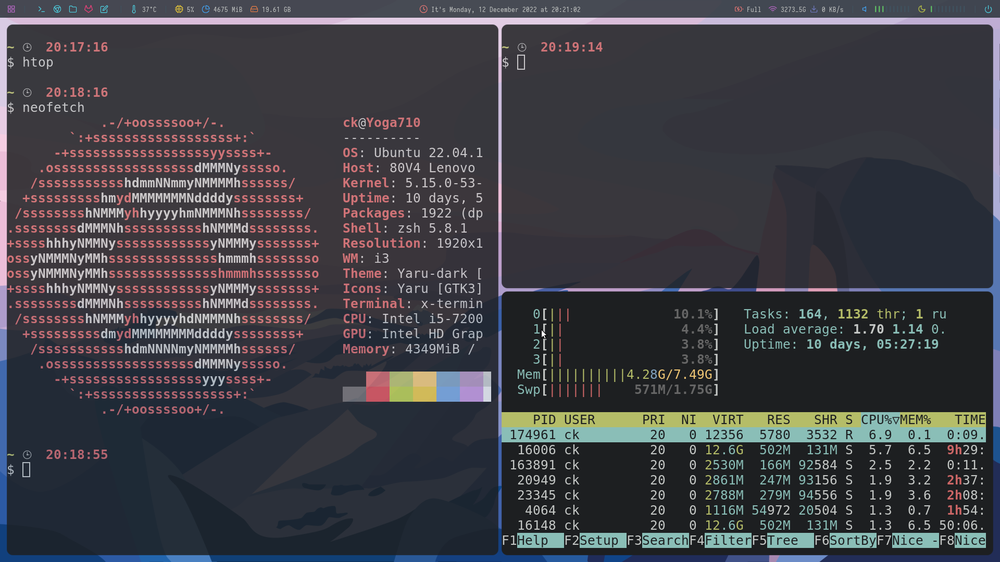

# my_dotfiles

### Device:
> Lenovo yoga 710

### Env:
- [x] sys: ubuntu 22.04 lts
- [x] wm: i3 gaps @ Airblader
- [x] picom @ jonaburg
- [x] rofi
- [x] polybar with themes @ adi1090x
- [ ] alacritty
- [ ] oh my zsh

### Screenshot
